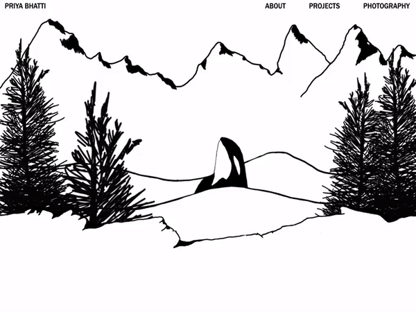

<h1>My Website </h1>

https://priya-bhatti.github.io/My-Website

Welcome, this site was prototyped in Figma and made using mostly CSS and HTML

 Prototyping in Figma is available <a href="https://www.figma.com/file/CnTQemfXFci4BFcZlRRIAC/My-website?node-id=0%3A1">here</a>

<h2>Design</h2>

As this is my personal site/portfolio I strived to design this site with the styles I enjoy. That includes a minimalist aesthetic while including interesting effects that are not too distracting for the user. I kept a mostly black and white scheme to keep it looking modern and clean.

<h2>Parallax Hero</h2>

I wanted to create an interesting parallax effect for the hero image for my site. Drawing inspiration from the things I love most (nature and the west coast of British Columbia) I created a layered hero image incorporating those elements

